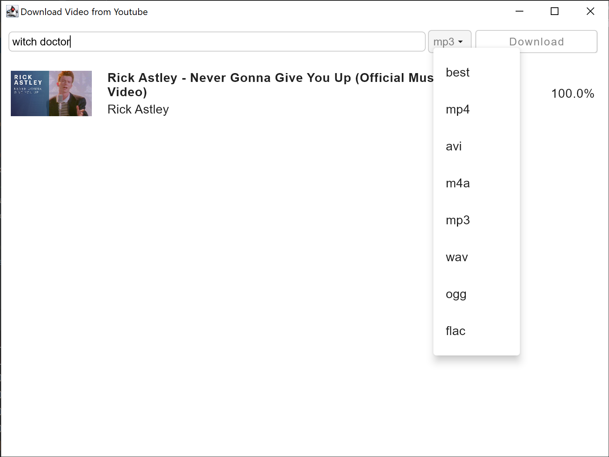

# YouTube Downloader
A minimalistic tool for downloading YouTube videos written in Kotlin. It isn't perfect, but it works (kind of).

## Usage 
Enter a link or search term into the top-left text-field, select your desired output format and click 
download. The video will be downloaded into the directory the jar file is being executed from. 

## Screenshots

